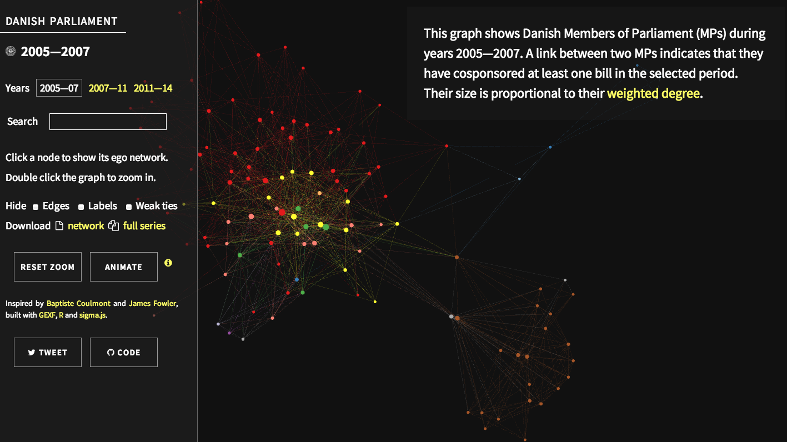

A scraper for Danish legislation (government bills, private bills and resolutions) that builds the bill [cosponsorship networks](http://jhfowler.ucsd.edu/cosponsorship.htm) for legislatures 2005-2007, 2007-2011 and 2011-2014. Get the networks by running `folketinget.r` in R until you get enough data and sponsors scraped. 

See the [interactive demo][demo]:

[][demo]

[demo]: http://briatte.org/folketinget
